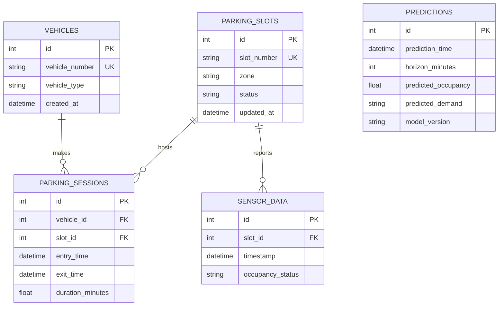

# ER diagram (Mermaid - renders on GitHub / VS Code preview)

```mermaid
erDiagram
    VEHICLES ||--o{ PARKING_SESSIONS : "makes"
    PARKING_SLOTS ||--o{ PARKING_SESSIONS : "hosts"
    PARKING_SLOTS ||--o{ SENSOR_DATA : "reports"
    VEHICLES { int id PK
              string vehicle_number UK
              string vehicle_type
              datetime created_at }
    PARKING_SLOTS { int id PK
                   string slot_number UK
                   string zone
                   string status
                   datetime updated_at }
    PARKING_SESSIONS { int id PK
                      int vehicle_id FK
                      int slot_id FK
                      datetime entry_time
                      datetime exit_time
                      float duration_minutes }
    SENSOR_DATA { int id PK
                 int slot_id FK
                 datetime timestamp
                 string occupancy_status }
    PREDICTIONS { int id PK
                 datetime prediction_time
                 int horizon_minutes
                 float predicted_occupancy
                 string predicted_demand
                 string model_version }
```
`predictions` is standalone (it describes the whole lot, not one slot). `exit_time IS NULL` means the vehicle is still parked.
